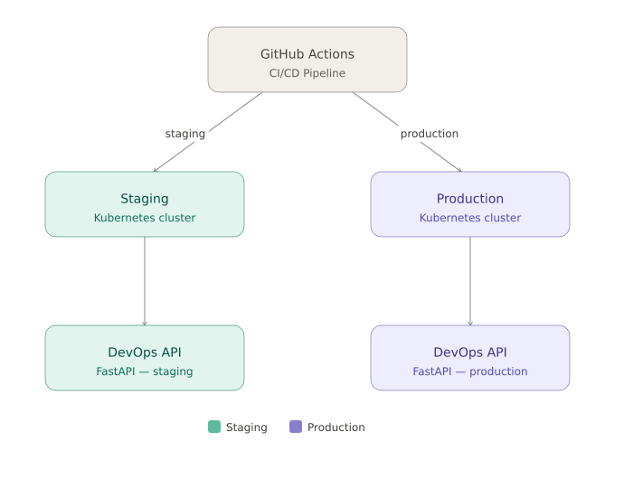

# DevOps API

REST API demonstrating a complete DevOps approach, from application to production deployment. This project covers the full chain: Python/FastAPI application, Docker containerization, Kubernetes orchestration, Infrastructure as Code with Terraform, and CI/CD pipelines with GitHub Actions.

## Table of Contents

- [Project Overview](#project-overview)
- [Architecture](#architecture)
- [Prerequisites](#prerequisites)
- [Getting Started](#getting-started)
  - [Run Locally](#run-locally)
  - [Run with Docker](#run-with-docker)
  - [Deploy on Kubernetes](#deploy-on-kubernetes)
  - [Provision with Terraform](#provision-with-terraform)
- [API Endpoints](#api-endpoints)
- [Tests](#tests)
- [CI/CD](#cicd)
- [Security](#security)
- [Environment Variables](#environment-variables)
- [Project Structure](#project-structure)

## Project Overview

This project is a REST API built with **FastAPI** that exposes infrastructure monitoring and security audit endpoints. It serves as a concrete demonstration of modern DevOps practices:

- **Application**: Python/FastAPI API with built-in OWASP security middlewares (HSTS, CSP, X-Frame-Options), host validation, and environment-based configuration.
- **Containerization**: Optimized Docker image with multi-stage build, non-root user, read-only filesystem, and dropped capabilities.
- **Orchestration**: Kubernetes manifests with `restricted` Pod Security Standards, deny-all NetworkPolicy by default, and health probes.
- **Infrastructure as Code**: Terraform provisioning with the Docker provider, isolated network, and security constraints.
- **CI/CD**: GitHub Actions pipelines covering lint, tests, security scans (Bandit, Safety, Trivy), Docker build, Terraform/K8s validation, staging deployment with smoke test, and production with automatic rollback.

## Architecture



## Prerequisites

- **Python** 3.12+
- **Docker** and **Docker Compose**
- **kubectl** (for Kubernetes deployment)
- **Terraform** 1.9+ (for IaC provisioning)

## Getting Started

### Run Locally

1. **Clone the repository**

```bash
git clone https://github.com/eminatabey/devops-api.git
cd devops-api
```

2. **Create a virtual environment and install dependencies**

```bash
python -m venv venv
source venv/bin/activate  # Linux/macOS
# or
venv\Scripts\activate     # Windows

pip install -r requirements.txt
```

3. **Start the development server**

```bash
uvicorn app.main:app --reload --host 0.0.0.0 --port 8000
```

4. **Access the API**

- Root: http://localhost:8000
- Health check: http://localhost:8000/api/v1/health
- Infrastructure status: http://localhost:8000/api/v1/infra/status
- Security audit: http://localhost:8000/api/v1/security/audit
- Swagger docs (debug mode): http://localhost:8000/docs

> To enable Swagger documentation, start with `APP_DEBUG=true uvicorn app.main:app --reload`

### Run with Docker

```bash
# Build and run in one command
docker compose up --build

# Or build and run separately
docker build -t devops-api .
docker run -p 8000:8000 devops-api
```

The API is then accessible at http://localhost:8000.

The container runs with the following security constraints:
- Non-root user
- Read-only filesystem
- No new privileges (`no-new-privileges`)
- CPU (0.5) and memory (256 MB) limits

### Deploy on Kubernetes

Apply the manifests in order:

```bash
kubectl apply -f k8s/namespace.yaml
kubectl apply -f k8s/networkpolicy.yaml
kubectl apply -f k8s/deployment.yaml
kubectl apply -f k8s/service.yaml
```

Verify the deployment:

```bash
kubectl get pods -n devops-api
kubectl get svc -n devops-api
```

### Provision with Terraform

```bash
cd terraform
terraform init
terraform plan
terraform apply
```

To destroy the infrastructure:

```bash
terraform destroy
```

## API Endpoints

| Method | Endpoint | Description |
|--------|----------|-------------|
| `GET` | `/` | Welcome message with app name and environment |
| `GET` | `/api/v1/health` | Health check (used by K8s probes) |
| `GET` | `/api/v1/infra/status` | Infrastructure services status |
| `GET` | `/api/v1/security/audit` | Security audit report |

## Tests

```bash
# Run all tests
pytest tests/

# Run a specific test with verbose output
pytest tests/test_api.py::test_health -v

# Run tests with short traceback
pytest tests/ -v --tb=short
```

## CI/CD

The project uses two GitHub Actions pipelines:

### CI (`ci.yml`) - Triggered on push/PR to `main`

| Job | Description |
|-----|-------------|
| **Lint** | Format checking and linting with ruff |
| **Tests** | pytest suite execution |
| **Security Scan** | SAST analysis with Bandit + dependency audit with Safety |
| **Docker Build** | Image build, push to GHCR, Trivy scan |
| **Terraform Validate** | `terraform fmt`, `init`, `validate` |
| **K8s Validate** | Manifest validation with kubeconform |

### CD (`cd.yml`) - Triggered on `v*` tag

1. **Release build**: versioned image build and push to GHCR + Trivy scan (blocking on CRITICAL)
2. **Staging deployment**: image update + automatic smoke test
3. **Production deployment**: image update + health check with automatic rollback on failure

```
push main --> CI (lint, test, scan, build) --> git tag v* --> CD (staging --> production)
```

## Security

Security is built into every layer:

| Layer | Measures |
|-------|----------|
| **Application** | OWASP headers (HSTS, CSP, X-Frame-Options, X-Content-Type-Options), host restriction, Swagger disabled outside debug mode |
| **Docker** | Multi-stage build, non-root user, read-only filesystem, drop ALL capabilities, CPU/memory limits |
| **Kubernetes** | `restricted` Pod Security Standards, `automountServiceAccountToken: false`, deny-all NetworkPolicy, seccomp RuntimeDefault |
| **Terraform** | Variable validation, containers with drop ALL capabilities and read-only filesystem |
| **CI/CD** | Bandit (SAST), Safety (dependencies), Trivy (Docker image), blocking on CRITICAL vulnerabilities in production |

## Environment Variables

All variables are prefixed with `APP_`:

| Variable | Description | Default |
|----------|-------------|---------|
| `APP_ENVIRONMENT` | Runtime environment | `development` |
| `APP_DEBUG` | Enables debug mode and Swagger docs | `false` |
| `APP_ALLOWED_HOSTS` | List of allowed hosts (JSON) | `["*"]` |

## Project Structure

```
.
├── .github/workflows/
│   ├── ci.yml                # Continuous integration pipeline
│   └── cd.yml                # Continuous deployment pipeline
├── app/
│   ├── config.py             # Configuration via environment variables
│   ├── main.py               # FastAPI entry point
│   ├── models.py             # Pydantic models
│   ├── routes.py             # API endpoints
│   └── security.py           # Security middlewares
├── k8s/
│   ├── namespace.yaml        # Namespace with Pod Security Standards
│   ├── networkpolicy.yaml    # Deny-all network policy
│   ├── deployment.yaml       # Deployment with probes and constraints
│   └── service.yaml          # ClusterIP service
├── terraform/
│   ├── main.tf               # Docker resources (image, network, container)
│   ├── variables.tf          # Variable definitions
│   ├── terraform.tfvars      # Variable values
│   ├── outputs.tf            # Terraform outputs
│   └── versions.tf           # Provider version constraints
├── tests/                    # pytest tests
├── Dockerfile                # Secure multi-stage build
├── docker-compose.yml        # Docker Compose with security constraints
├── requirements.txt          # Python dependencies
└── README.md
```
